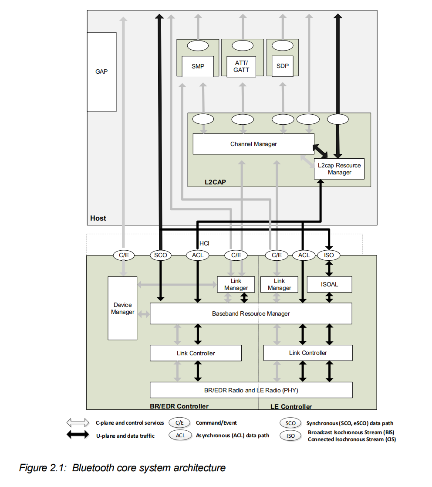
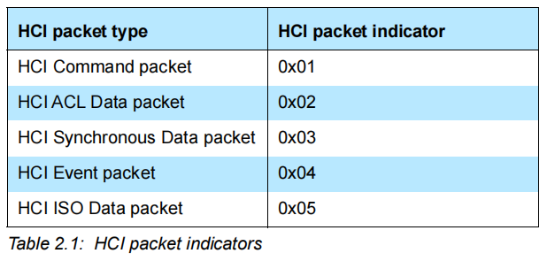
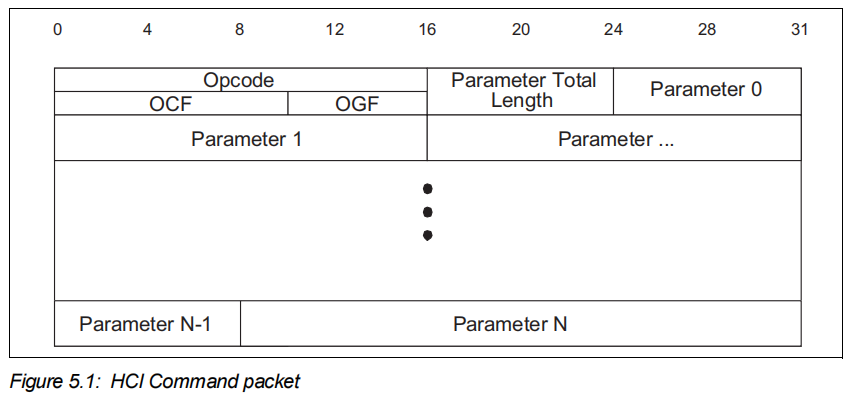
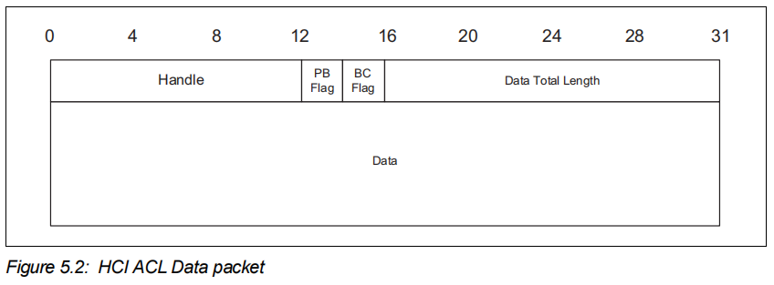
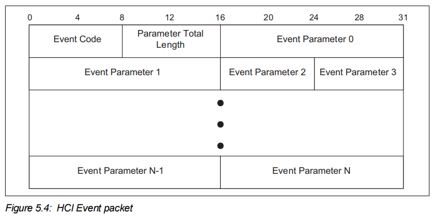
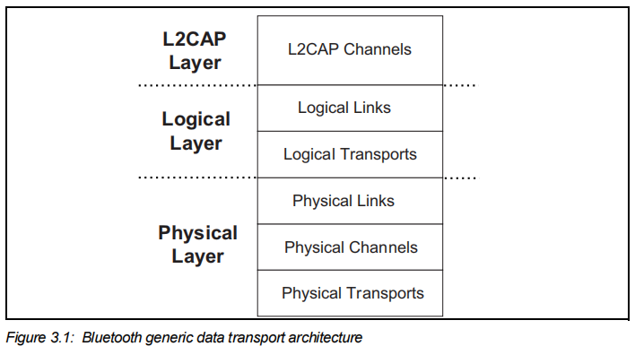
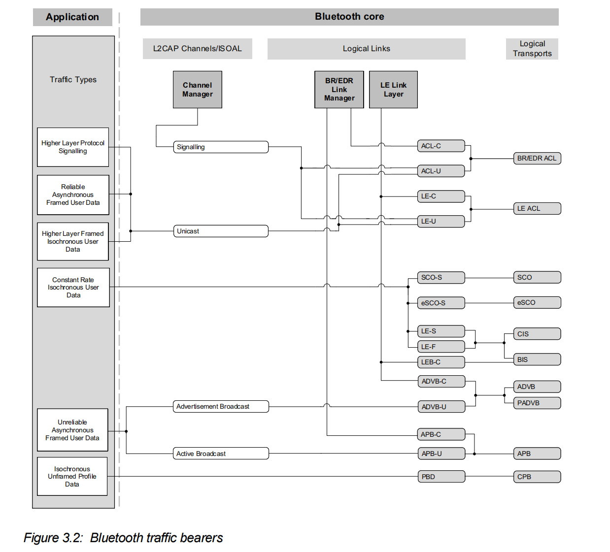
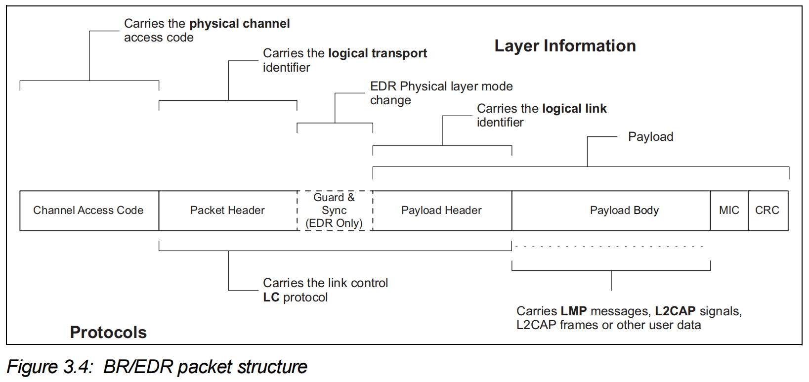
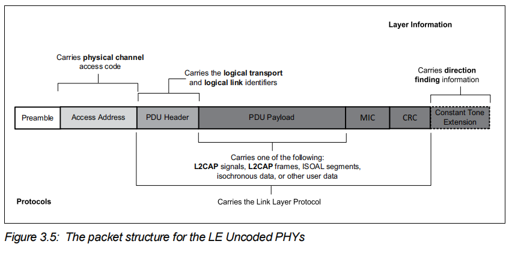
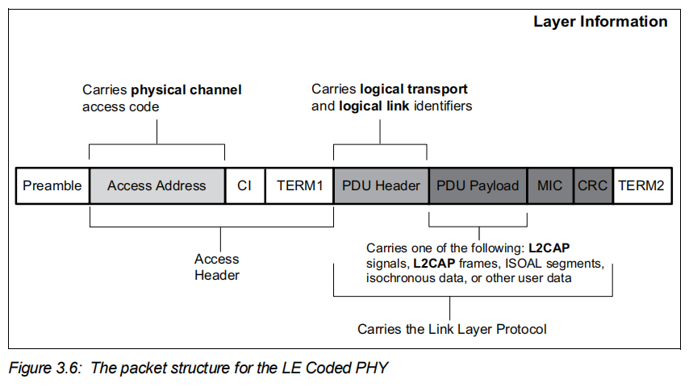

在前一篇蓝牙概述中，我们了解了蓝牙的基础定义、版本演进与各类应用场景。本篇我们基于蓝牙技术联盟 SIG 官方标准架构图，拆解蓝牙完整分层系统架构。

# Core system architecture

整张架构图最核心的分割线是**HCI 接口**，它把蓝牙系统一分为二：上层运行协议栈的 Host 主机，下层负责无线信号收发的 Controller 控制器，两者通过标准化 HCI 通道传输控制指令与业务数据。

## 1. Host

Host包含以下模块：

* **Channel manager**

  负责 L2CAP 通道的**创建、管理、关闭**，承载上层服务协议与应用数据。和远端设备的通道管理器协商建立 L2CAP 通道，把通道端点对接至对应上层模块（GATT、SDP 等）。调用本地链路管理器（logic link manager），按需建立底层逻辑链路，并配置链路 QoS 服务质量，匹配不同数据的传输需求。

* **L2CAP resource manager**

  管控 PDU 分片下发基带的顺序，做多通道调度，保障有 QoS 保障的通道不会因为控制器缓冲区、HCI 带宽耗尽而拿不到物理信道。L2CAP 资源管理器还可以执行流量合规校验，检查上层应用提交的 L2CAP SDU 数据是否在协商好的 QoS 参数范围内。

* **Security Manager Protocol（SMP）**

  安全管理协议（SMP）是点对点协议，用于生成加密密钥与身份密钥。该协议运行在一条专用固定的 L2CAP 通道之上。SMP 模块同时负责加密密钥、身份密钥的存储管理，完成随机地址生成，以及将随机地址解析为已知设备身份。SMP 模块直接与控制器交互，在配对、加密流程中向控制器提供保存的密钥，用于加密与设备鉴权。该模块仅用于 LE（低功耗蓝牙）系统。在 BR/EDR 经典蓝牙中，与之对等的功能是放在控制器内部的链路管理器（Link Manager）。
  将 SMP 放置在 LE 的 Host 主机层，目的是降低仅支持 LE 的控制器的硬件实现成本。

* **Attribute Protocol（ATT）**

  属性协议（ATT）模块实现 ATT 服务端与 ATT 客户端之间的点对点通信协议。ATT 客户端通过一条专用固定 L2CAP 通道，和对端设备的 ATT 服务端进行交互。ATT 客户端向 ATT 服务端发送 commands, requests 和 confirmations；ATT 服务端向客户端返回 responses, notifications 以及 indications。通过 ATT 客户端的各类命令与请求，就可以对对端 ATT 服务端设备上的属性值执行read、write操作。

* **Service Discovery Protocol（SDP）**

  服务发现协议（SDP）是**BR/EDR 经典蓝牙的服务发现协议**，采用客户端‑服务端模型。连接建立完成之后，客户端通过 SDP 查询对端设备提供哪些服务，获取服务的 UUID、访问参数（例如 RFCOMM 通道号、L2CAP‑PSM）；**SDP 只做查询，本身不会去调用、使用这些服务**。

* **Generic Attribute Profile（GATT）**

  通用属性配置文件（GATT）模块封装了 ATT 服务端的全部功能，也可选择性实现 ATT 客户端功能。该配置文件将 ATT 服务端内部的属性组织成**服务-特征值-属性**这样的层级结构。GATT 模块对外提供接口，用来完成服务与特征的发现、读取、写入以及指示通知操作。在 LE 设备上，GATT 用于 BLE 的 Profile 服务发现。

* **Generic Access Profile（GAP）**

  通用访问配置文件（GAP）模块实现所有蓝牙设备都必须具备的基础功能，包含传输层、协议层以及应用配置文件所使用的工作模式与接入流程。GAP 提供的能力包括：设备发现、连接模式、安全处理、鉴权、关联模型以及服务发现。

> 其中 L2CAP, SDP and GAP 等模块构成 BR/EDR Host。L2CAP, SMP, Attribute protocol, GAP and Generic Attribute Profile (GATT) 等模块构成 LE Host。BR/EDR/LE 双模主机，整合了 BR/EDR 主机与 LE 主机各自全部功能模块。

## 2. Controller

Controller包含以下模块：

* **Device manager**

  设备管理器是基带内部的功能模块，用于管控蓝牙设备的整体行为。它负责蓝牙系统中所有和数据传输没有直接关联的操作，例如扫描周边蓝牙设备、发起设备连接，让本机可以被其他设备发现、被其他设备连接。设备管理器需要向基带资源控制器申请信道资源，才能执行上述功能。设备管理器同时处理大量 HCI 命令对应的本地设备行为，例如管理设备本地名称、保存链路密钥，以及其他相关功能。

* **Link manager（LM）**

  链路管理器负责logical link（以及必要时配套的logical transports）的创建、修改与释放，同时维护设备之间物理链路的相关参数更新。链路管理器通过与对端设备的链路管理器进行交互完成上述工作：BR/EDR 经典蓝牙使用**Link Manager Protocol（LMP）**，LE 低功耗蓝牙使用**Link Layer Protocol（LL）**。LM 或 LL 协议可按需创建设备间的 logical links 与 logical transports ，同时完成链路和传输属性的整体控制，例如在逻辑传输通道上开启加密、调整物理链路的发射功率，或是对 BR/EDR 逻辑链路调整 QoS 服务质量参数。

* **Baseband resource manager**

  基带资源管理器负责对无线射频介质的全部访问。

* **Link Controller（LC）**

  链路控制器负责基于data payload，以及物理信道、逻辑传输、逻辑链路相关参数，完成蓝牙数据包的编码与解码工作。链路控制器配合基带资源管理器的调度功能，执行 BR/EDR 的链路控制协议信令以及 LE 的链路层协议信令，用于交互流量控制、应答、重传请求信号。对这些信令的解析，由基带数据包所绑定的逻辑传输通道决定。链路控制信令的解析与管控，通常和资源管理器的调度器协同工作。

* **PHY**

  物理层（PHY）模块负责在物理信道上完成信息数据包的发送与接收。基带与 PHY 模块之间存在一条控制通路，基带可以借此控制 PHY 的时序以及载波频率。PHY 模块完成数据流在基带与物理无线信道之间的格式转换。

* **Isochronous Adaptation Layer（ISOAL）**

  同步适配层（ISOAL）让上层可以灵活地向链路层收发同步数据流，允许上层数据包的大小、发送周期与链路层数据包的大小、周期不一致。ISOAL 通过fragmentation/recombination或者segmentation/reassembly，完成上层数据单元和下层链路层数据单元之间的互相转换。

## 3. HCI

通过UART传输层可发送五种 HCI 数据包： HCI Command packet、HCI Event packet、HCI ACL Data packet、HCI Synchronous Data packet以及HCI ISO Data packet。HCI Command packet只能由Host发送至Controller。HCI Event packet只能由Controller发送至Host。而 HCI ACL/Synchronous/ISO Data packet则可在Host和Controller之间双向发送。

**HCI Data Formats**

# Data Transport

出于传输效率以及兼容旧版本的考量，蓝牙传输架构对逻辑层做了进一步划分，区分**逻辑链路（Logical Links）**与**逻辑传输（Logical Transports）**。该划分定义了通用的逻辑链路概念：逻辑链路用于在两台或多台设备之间提供一条独立通信通路。而逻辑传输则用来描述不同类型逻辑链路之间的相互依存关系，即一条逻辑链路可以复用、依附于另一条逻辑传输。例如 BR/EDR 中 ACL 作为基础逻辑链路，SCO 音频链路复用同一个 ACL 物理载体，这种依附关系就靠逻辑传输描述。

## 1. Core traffic bearers

| 符号 | 含义                                                         |
| ---- | ------------------------------------------------------------ |
| C    | control links carrying LMP or LL messages                    |
| U    | L2CAP links carrying user data   (L2CAP PDUs)                |
| S    | stream links carrying unformatted synchronous or isochronous data |

### Framed 和 Unframed

蓝牙传输分为带帧数据与无帧数据两大体系，仅 BR/EDR 经典蓝牙同时支持二者，BLE 低功耗蓝牙仅支持带帧数据、完全不具备无帧传输能力。带帧数据依托 L2CAP 通道承载，上层以可变长度独立帧交付业务数据，支持多路复用、分片重组、MTU 与 QoS 协商，细分面向连接通道（BR/EDR、BLE 通用，承载 SDP、GATT、RFCOMM、变速率等时音频等点对点业务）与仅 BR/EDR 支持的无连接通道（用于低延迟广播、短报文单播），同时存在链路建立时自动生成、参数不可协商的固定 L2CAP 通道承载 ATT、SMP 等底层信令；

而无帧数据无需经过 L2CAP，应用直接对接基带 SCO‑S、eSCO‑S、PBD 三类逻辑链路，仅适配恒定码率等时码流（典型为 PCM 语音），链路预占用固定射频带宽、按微微网时钟以固定周期收发定长数据包，其中 SCO/eSCO 用于点对点语音通话（eSCO 相比 SCO 支持 EDR、多比特率与有限重传，可靠性更强），PBD 是唯一支持单点对多点广播的无帧链路，三类无帧链路均不支持多路复用与协议栈分层封装，且变速率等时数据只能通过 L2CAP 带帧通道传输；实际业务常采用分离架构，语音码流走无帧链路承载用户面数据，控制信令则通过 L2CAP 带帧通道交互。

### Reliability of traffic bearers

**BR/EDR reliability**

蓝牙作为一种无线通信系统，在射频环境较差的情况下，信息传输就变得不可靠（unreliable）了。为应对这一问题，协议栈在每一层都设置了分级防护机制。基带数据包头部采用前向纠错（FEC）编码，接收端可借此完成纠错。同时搭配头部差错校验（HEC），用来检出纠错后依然残留的错误。部分基带数据包类型会对载荷也启用 FEC 纠错；除此之外，还有部分基带包附带循环冗余校验（CRC）做完整性校验。

在 ACL 逻辑传输通道上，差错检测算法的输出结果会驱动一套简易 ARQ 自动重传协议：接收端校验失败的数据包，发送端会重新发送，以此提升传输可靠性。该机制可适配低时延敏感报文场景做优化 —— 若数据包的有效生命周期已过期，发送端会直接丢弃本次传输失败的报文，不再重传。eSCO 链路采用这套机制的改良版本，通过限定最大重传次数，在保证语音可靠性的同时控制传输延迟。

**LE reliability**

和经典 BR/EDR 一样，射频环境较差时，BLE 原生传输本身不可靠。为此协议栈分层提供多级防护机制：LL（链路层）数据包采用CRC对整包载荷做完整性校验。若载荷 CRC 校验失败，接收端不会回复 ACK 确认，发送端会自动重传该数据包。

## 2. transport architecture entities

### BR/EDR generic packet structure

* **Channel Access Code（CAC）**

  标识当前物理信道，过滤同射频载波下其他微微网的无关数据包。极简报文（如查询请求包）仅保留 CAC，无后续所有字段。

* **Packet Header**

  LT_ADDR: 3-bit logical transport address 

  TYPE: 4-bit type code 

  FLOW: 1-bit flow control 

  ARQN: 1-bit acknowledge indication 

  SEQN: 1-bit sequence number 

  HEC: 8-bit header error check 

* **Guard & Sync（EDR Only）**

  EDR 增强速率数据包独有字段：调制模式切换的同步序列与保护间隔，用于物理层调制方式切换同步。

* **Payload Header**

  LLID：使用哪种Logical Link（2bit）

  FLOW：流量控制（1bit）

  LENGTH：长度（5bit for BR，10bit for EDR）

* **Payload Body**

* **Message Integrity Check（MIC）**

  消息完整性检查，可选的，在启用了AES-CCM后才会存在这个字段

* **CRC**

  循环冗余校验，EDR在CRC之后还会跟一个trailer

### LE generic packet structure

