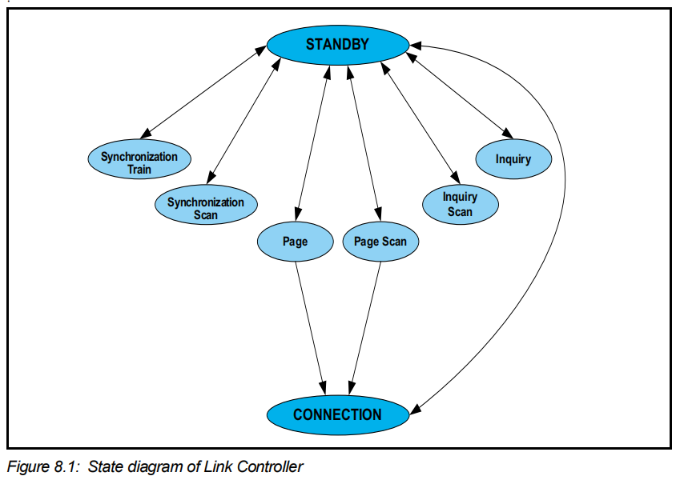
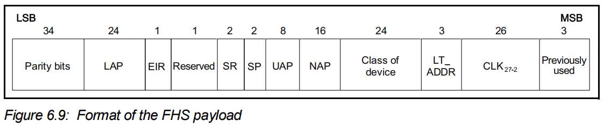
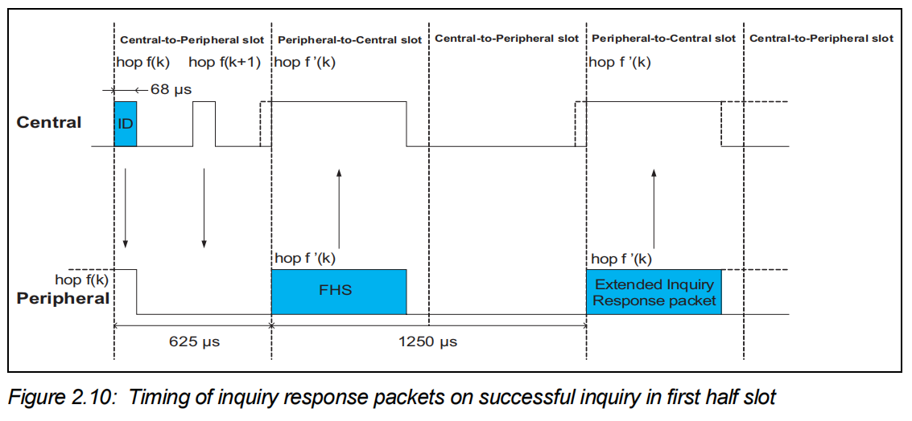
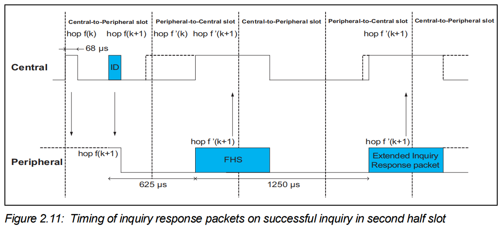
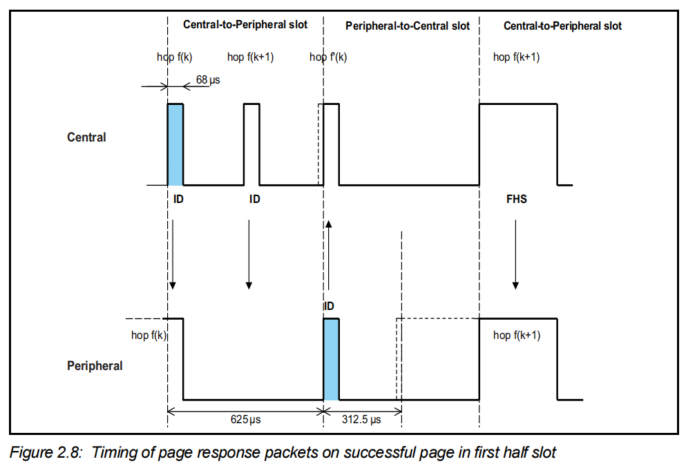
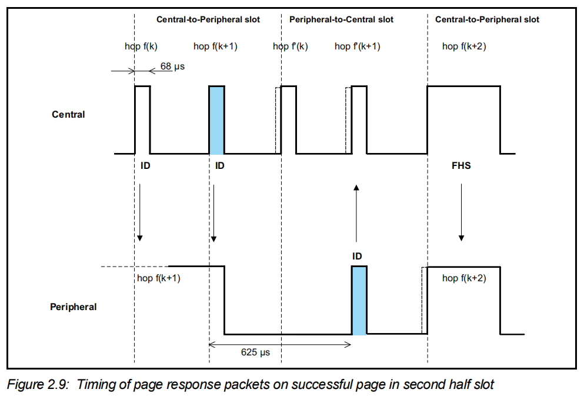

在耳机第一次连接手机时，我们需要先长按耳机的配对键，使耳机处于一个可被发现状态。此时如果手机的蓝牙开关是打开的，那么就能在下方的设备列表里面找到此耳机，然后点击耳机的蓝牙名，就可以连上啦。那么这中间蓝牙都做了哪些操作呢？我们一步一步看。首先我们来看一幅图

这张图所示是Link Controller的状态图，包含了两个核心状态：STANDBY and CONNECTION 以及6个子状态：Page, Page Scan, Inquiry, Inquiry Scan, Synchronization Train, Synchronization Scan（图中未显示的3个子状态：Central Response, Peripheral Response, Inquiry Response）。

# Inquiry

> 我们将进入inquiry substate的设备称为Central，将进入inquiry scan substate的设备称为Peripheral

## 交互流程

耳机长按配对键进入配对模式，Link Controller会进入inquiry scan substate扫描周边设备。此时手机打开蓝牙开关，手机的Link Controller会进入inquiry substate持续发送ID数据包，耳机一旦收到ID数据包，会立即进入Inquiry Response substate并回复一个FHS数据包，以及一个可选的Extended Inquiry Response packet（EIR）。

这是FHS数据包的payload，其中LAP、UAP、NAP三个字段组成了Peripheral的蓝牙地址。EIR表示后续有没有跟Extended Inquiry Response packet。Class of device表示Peripheral的设备分类。蓝牙终端设备的这个字段决定了其在手机上被搜索到时会显示成什么图标。比如耳机会显示一个耳机图标，鼠标会显示出一个鼠标图标，就是由这个字段决定的。LT_ADDR是逻辑传输地址，在inquiry过程中，这个字段始终是0。

**EIR**整体由若干个 **AD 结构（AD‑structure）**串联组成，每个 AD 结构 = `Length(1字节) + AD Type(1字节) + AD Data(Length-1字节)`。总最大有效载荷 **240 字节**。具体由哪些Data Type可以查阅Assigned Numbers。举几个比较常用的例子：Local Name（Type=9）蓝牙设备的名字；Tx Power Level（Type=10）发送功率等级；Service Uuids（Type=3）16位Service或Service Class Uuid完整列表。

.png "EIR")

## 时序

ID包只携带GIAC（general inquiry access code）或者DIAC（dedicated inquiry access code）所以数据量非常小，跳频速率可以达到3200 hop/s。并且在同一个TX slot（一个slot 625μs）内，Central可以在两种频率上分别发送一次ID包。那么Peripheral收到ID包就分为了两种情况，一种是在前半个slot收到，一种是在后半个slot收到。这两种情况有些细微的差别，可以从下面两幅图中看出来。虽然都是在收到ID包后间隔625μs发送FHS包，但是如果是在前半个slot收到的话，FHS就是在hop f'(k)频率上发送，而如果是在后半个slot收到，那么FHS就会在hop f'(k+1)频率上发送。如果Peripheral还需要发送extended inquiry response packet，那么就应该在相同频率下，开始发送FHS间隔1250μs后跟着发送。

> f(k)表示 inquiry设备的跳频序列，f'(k)表示相应的inquiry response频率序号。f'(k)可以由f(k)以及GIAC/DIAC推导出来。

在收到EIR后，inquiry流程就结束了。此时手机已经知道了耳机的设备类型以及蓝牙名称，就可以完整的在设备列表中显示出来了。此时用户再点击连接，就可以进行下一步了。

# Page

> 尽管在连接建立之前尚未定义Central与Peripheral，但Central用于指代paging device（该设备在连接状态下将变为Central），而Peripheral则用于指代page scanning device（该设备在连接状态下将变为Peripheral）。

手机拿到耳机 BD_ADDR（FHS里面的LAP、UAP、NAP） 后，通过 Page 发送 DAC（由BD_ADDR计算得出，每个设备唯一） 设备接入码，唤醒休眠 / 扫描态的从机，手机无法准确获知耳机何时唤醒以及处于哪个跳频频率下。因此，手机会在不同的跳频频率下连续发送一系列相同的page messages，并在各发送间隔之间进行监听，直至收到来自耳机的响应。耳机会周期性的进入page scan substate，直到扫描到自己的地址生成的DAC后，马上进入page response substate并回复一个ID数据包（Response）。手机收到Response后会回复一个FHS，携带自身的时钟信息，耳机会根据这里携带的时钟信息调整自己的时钟跟手机时钟保持一致。所以耳机还需要回一次Response，这时才代表微微网建立完成。

跟inquiry类似，page也是发送携带DAC的ID数据包，每个slot发送两次。跳频频率为3200 hop/s

在Peripheral收到FHS间隔625μs后还应发送一次Response，表示时钟已同步。此时page流程完成。但是此时蓝牙还是没有“连接”上。需要等到ACL建立上以后，蓝牙连接才算完成。此时手机才能真正使用蓝牙耳机来听音乐、打电话等等。
